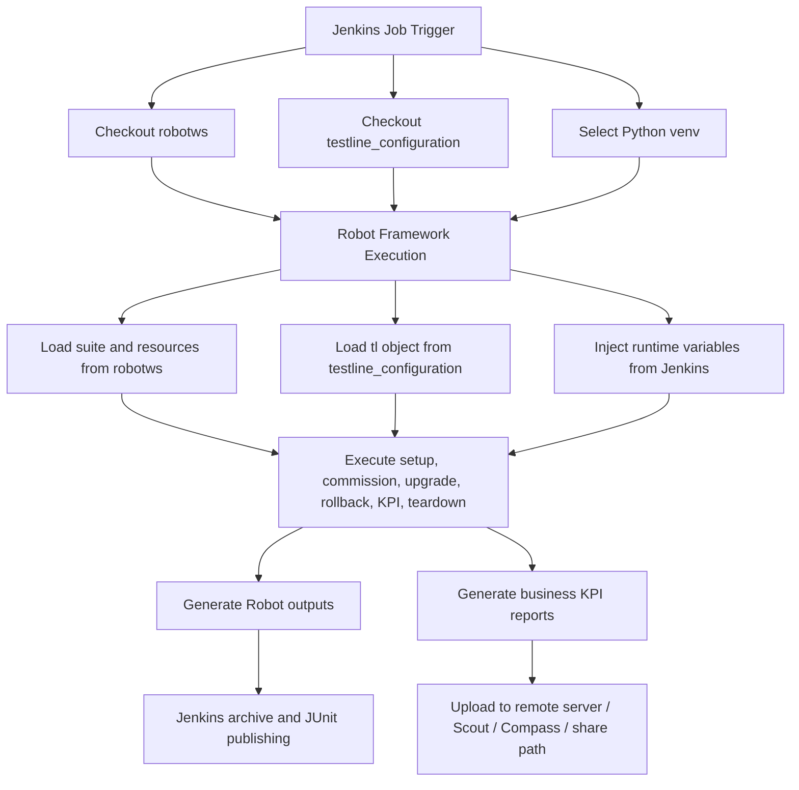

```mermaid
flowchart TD
    A[Jenkins Job Trigger] --> B[Checkout robotws]
    A --> C[Checkout testline_configuration]
    A --> D[Select Python venv]
    B --> E[Robot Framework Execution]
    C --> E
    D --> E
    E --> F[Load suite and resources from robotws]
    E --> G[Load tl object from testline_configuration]
    E --> H[Inject runtime variables from Jenkins]
    F --> I[Execute setup, commission, upgrade, rollback, KPI, teardown]
    G --> I
    H --> I
    I --> J[Generate Robot outputs]
    I --> K[Generate business KPI reports]
    K --> L[Upload to remote server / Scout / Compass / share path]
    J --> M[Jenkins archive and JUnit publishing]
```